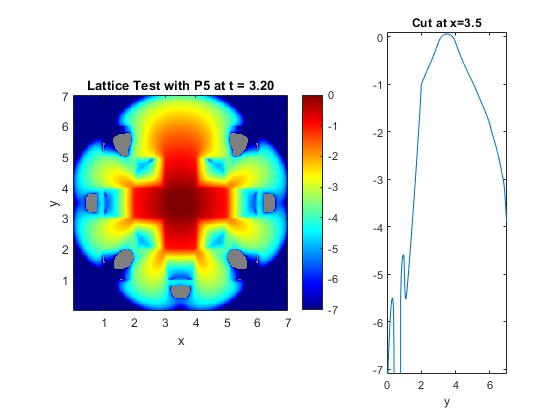

<!--

**Here are some ideas to get you started:**

🙋‍♀️ A short introduction - what is your organization all about?
🌈 Contribution guidelines - how can the community get involved?
👩‍💻 Useful resources - where can the community find your docs? Is there anything else the community should know?
🍿 Fun facts - what does your team eat for breakfast?
🧙 Remember, you can do mighty things with the power of [Markdown](https://docs.github.com/github/writing-on-github/getting-started-with-writing-and-formatting-on-github/basic-writing-and-formatting-syntax)
-->

StaRMAP (Staggered grid Radiation Moment Approximation) is a simple, yet powerful, methodology to solve spherical harmonics moment systems, such as the time-dependent PN and SPN equations, of radiative transfer. The implementation allows the user to selected arbitrary moment order N, and the moment matrices and stable time step sizes are generated/chosen automatically. The numerical methods makes use of the specific coupling between the moments in the PN equations. The methodology is implemented in Matlab in a fully vectorized fashion, yielding highly competitive computational efficiency. The code can effectively handle 1D, 2D, and 3D spatial geometries with one single implementation.

# Gallery of Examples 

Numerical convergence analysis using manufactured solution in 2D. 

Temporal evolution of discrete L2 norm of numerical solution in 2D.

2D Checkerboard test case with various moment orders (P3, P5, P15, P39)

    

   

3D Lattice test case with P7.

3D Point Source test case with SP39.

